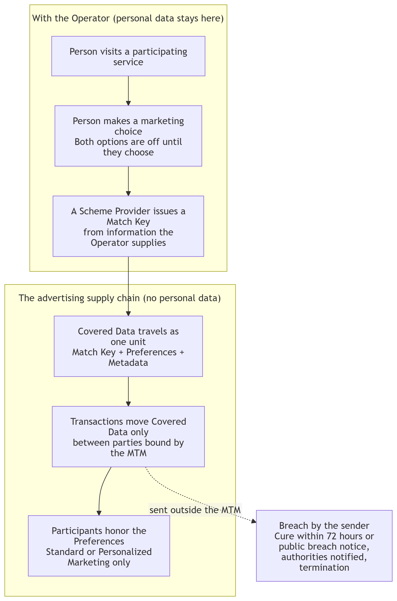
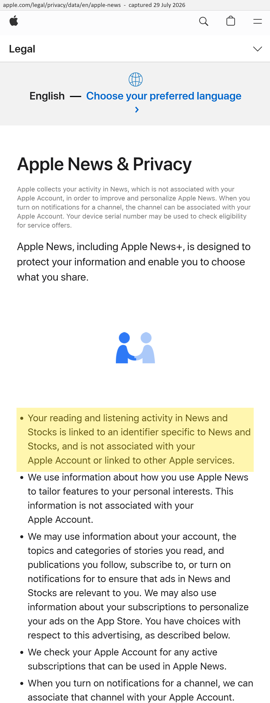
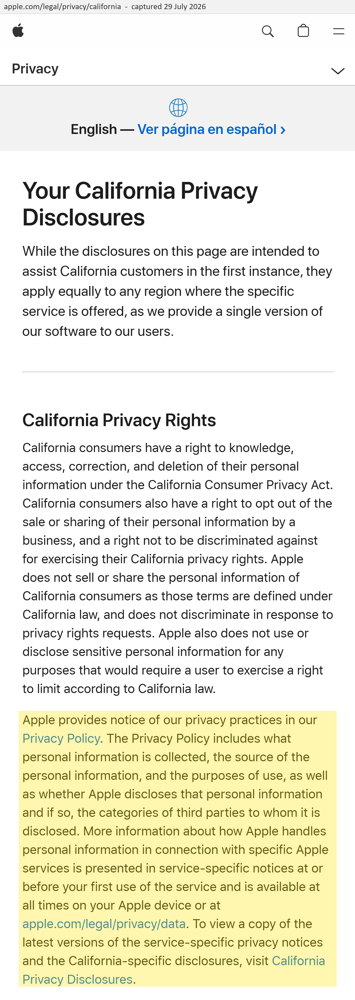

EXPLAINER FOR THE MODEL TERMS FOR MARKETING

**DISCLAIMER**

*This document is provided for general informational purposes only and is not
legal advice. It is intended to give an overview of the Model Terms for
Marketing (the “Contract”), but it does not replace or modify the Contract
itself.*

*For the full terms, see the [Contract](2.txt).*

---

## 1. Summary

The Model Terms for Marketing (the MTM) are a standard contract for the
advertising supply chain. This document calls the arrangement they create the
MTM scheme. Every participant that handles covered data under them is bound by
the same rules, and the rules cannot be varied. Not all advertising data is
inside the scheme from day one. The MTM governs the covered data brought within
it, and leaves other data in the supply chain unchanged.

Under the MTM scheme, advertising works without personal data moving through the
supply chain. The scheme is designed so that the personal data stays with the
organization the person actually visits or already deals with (the Operator,
typically a publisher). Everyone downstream receives a Match Key, a technical
reference the scheme leaves them no lawful way to link to a person, bundled with
the person's advertising preference and the metadata (creator domain, timestamp
and cryptographic signature). Some AdTech businesses have the technical means to
link data like this to other data or to track individuals. The MTM takes the use
of those means away by contract. Every recipient warrants that it has no means
reasonably likely to be used to identify anyone from the Covered Data, a
warranty the contract itself supports, is barred from using the means it has, or
acquiring more, to identify anyone, and faces termination, public breach notices
and notification of the data protection authorities if it tries.

Under the MTM, covered data is not personal data in the hands of recipients.
This position follows from the definition of personal data in the GDPR and from
three decisions of the Court of Justice of the European Union, explained in
section 5. Those decisions ask a practical question. Can this organization, with
the means reasonably available to it, identify a person from the covered data?
Where the answer is no, the data is not personal data for that organization,
even though it remains personal data for the Operator, who stays fully subject
to the GDPR. United States privacy law points the same way, with California's
statute setting out the mechanism expressly (section 6).

The person's choice sits alongside the Match Key. There are two marketing
settings, described in section 4, and both are off until the person makes an
affirmative choice, which they can change at any time. Sensitive data is
excluded from the MTM scheme entirely.

Today's approach repeatedly asks people to consent, through banners, to personal
data being shared with hundreds of companies they have never heard of and do not
need to know about. While this is lawful, it creates friction for the Open Web,
friction that "walled gardens" have removed for themselves by asking for consent
once across many products. Instead, the MTM approach removes the personal data
from the supply chain. It also changes the incentives of the supply chain
participants. A business that breaks the MTM contract is cut off from receiving
data, while a business that keeps to the contract can point to its participation
to set itself apart. We think that is a better answer for people, publishers,
advertisers and regulators, and the rest of this document explains why.

## 2. The problem

The modern web is funded by advertising. Journalism, creative work and
specialist information are free to access because publishers sell advertising
space. Privacy law is right to demand that this does not come at the cost of
people's data being taken without meaningful control.

But the way consent is implemented today has failed the people who use the Open
Web and the publishers who depend on it. People face cookie banners that are too
frequent, too complex and too legalistic to produce real understanding, and
consent collected this way launders the broadcast of personal identifiers and
browsing data to a long vendor list in real-time bidding. Critics of that system
are correct. Consent collected through fatigue does not amount to a real choice,
and a bid request that carries a person's identifiers to hundreds of recipients
does not protect that person.

Fixing this by concentrating advertising inside a single browser or platform
ecosystem creates a different harm, handing control of the Open Web's funding to
a handful of gatekeepers. Removing personalized advertising from the Open Web
while retaining it for others would destroy the economic model for the Open Web.
A decentralized answer is needed that addresses the privacy problem while
fostering competition.

## 3. How it works

The MTM scheme is built around a technical signal called a Match Key.
- A person visits a participating service. The service, or the party operating
  on its behalf, is the Operator. The Operator is the only participant with a
  relationship with the person, and the design intent is that only the Operator
  holds the underlying personal data.
- The person makes a simple advertising choice (section 4). The Operator
  collects that preference.
- A Scheme Provider issues a Match Key from information the Operator supplies.
  This step happens on the Operator's side of the scheme, where the personal
  data stays and privacy law applies in the ordinary way. The Match Key is just
  a reference. Any technology provider can act as Scheme Provider under the MTM
  scheme, which is neutral about who creates the Match Key.
- The Match Key, the person's Preferences and the Metadata travel together as
  one unit, called Covered Data. The Metadata is the creator domain, a timestamp
  and a cryptographic signature. It records where the data came from and when,
  and supports checking that the data has not been altered. Features beyond this
  are a matter for competition between Scheme Providers.
- Covered Data moves only through Transactions, controlled exchanges between
  parties who have both agreed to be bound by the MTM. Sending Covered Data,
  whole or with parts stripped away, to anyone not bound by the MTM is a breach
  by the sender.

Every participant that receives Covered Data is bound by the same core
obligations. There is no first-party or platform exemption. In brief, a
participant must:
- honor the person's Preferences, so a Match Key is never used for
  personalization the person has not chosen;
- use Covered Data only for a closed list of purposes (delivering, measuring and
  optimizing content, security and fraud prevention, product development, and
  legal compliance);
- never attempt to identify the person associated with a Match Key, and warrant
  that it cannot;
- never use sensitive data (racial or ethnic origin, political opinions,
  religious or philosophical beliefs, health, sex life or sexual orientation,
  genetic or biometric data, criminal history, or anything else classed as
  special category data) in connection with Covered Data;
- apply appropriate security and publish a notice explaining how it handles
  Covered Data; and
- report breaches, cure them within 72 hours or publish a public breach notice,
  and notify the relevant data protection authorities where a breaching
  participant fails to cure or to publish the notice.

A breach can also lead to termination of the participant's right to receive data
under the MTM.

## 4. The person's choice

People are offered two settings, both off by default.

Standard Marketing allows the Match Key to support the ordinary machinery of
advertising that does not draw on the browsing or interactions associated with
the Match Key, such as technical ad delivery, billing, measurement, attribution
and optimization.

Personalized Marketing additionally allows the Match Key to be used to select
advertising related to the browsing or interactions associated with it, always
subject to the MTM scheme.

In both settings the activity involved is the history of the Match Key, not of a
person. At best it relates to a device and a piece of software over some period
of time.

Nothing is enabled until the person makes an affirmative choice, and the choice
can be viewed and changed at any time through the preference interfaces of
participating services. The scheme asks for this affirmative choice even though
recipients hold no personal data. That is deliberate, and it goes further than
the law requires of the recipients. The Operator's own duties under privacy law
are separate and unchanged. One clear, durable decision replaces vendor lists
and purpose descriptions that few people read. The MTM does not itself remove
repetition, so people will be asked on each site they use, although implementors
can choose to share the interface and the stored response across sites and
devices. The MTM leaves that choice to competition.

A person who declines both settings, or never engages with the question, ends in
the same position as if nothing had been asked. Both settings stay off, and a
recipient of Covered Data that carries no Preference may not use it for either
form of marketing. Services can still sell advertising chosen from the content
of the page being viewed, as they always have. Choosing the ad that way uses no
data about the person, and that contextual advertising sits outside the scheme
entirely.

Browser-level signals such as the Global Privacy Control (GPC) sit alongside
this choice without changing who makes it. GPC tells businesses not to sell or
share the person's personal data, and the scheme meets that instruction by
design, because recipients are sent no personal data to sell or share. The
marketing question is a different and narrower one. It is asked of the person by
the service through the preference interface, and only the person's answer there
creates a Preference. A browser-wide signal turns nothing on, and with both
settings off for everyone by default it has nothing to turn off. A person whose
browser sends GPC can still choose Standard or Personalized Marketing, and that
affirmative, service-specific choice governs the Preference. Section 6 explains
how California's rules on preference signals support this reading.

## 5. Why this data is not personal data in recipients' hands

The GDPR defines personal data as information relating to an identified or
identifiable person (Article 4(1)). Recital 26 explains how to judge
identifiability. Account should be taken of all the means reasonably likely to
be used, considering the cost, time and technology involved. Data that one
organization can link to a person may therefore be impossible for another
organization to link to anyone. The question is always asked of a specific
holder with specific means. Three decisions of the CJEU establish this.

**Breyer (C-582/14, 2016).** A dynamic IP address held by a website operator was
personal data only because German law gave the operator a lawful channel to
obtain the linking information from the internet provider. The Court held that
identification must be practically and lawfully possible, not merely
conceivable, and that means are not reasonably likely to be used where
identification is prohibited by law or practically impossible. An abstract,
theoretical risk does not make data personal.

**SRB (EDPS v SRB, C-413/23 P, 2025).** The Single Resolution Board shared
pseudonymized comments with the consultancy Deloitte. The Court confirmed that
identifiability must be assessed from the perspective of each recipient, and
that pseudonymized data is not automatically personal data for every recipient
in every circumstance. Where the recipient has no lawful means to obtain the
additional information needed to identify anyone, the data is not personal data
in its hands, even though it remains personal data for the sender.

**Scania (C-319/22, 2023).** A vehicle identification number is not, in itself,
personal data. It becomes personal data only for someone who reasonably has the
means to connect it to a specific person.

Now apply that test to the MTM scheme. Many advertising businesses have the
technical means to link a reference like a Match Key to other data. The MTM
takes the use of those means away. Through the scheme a recipient receives no
name, no contact details, no raw identifiers and no browsing history tied to an
identity. It warrants that it has no means lawfully available to be used to
identify anyone from the Covered Data, and it is barred from using the means it
has, or acquiring more, to identify anyone, including by combining Covered Data
with other data it holds. Any attempt is a breach that exposes it to
termination, a public breach notice and notification of the data protection
authorities.

The prohibition is contractual and carries penalties. It is published publicly
and it cannot be varied. Breaking it risks discovery through the notices the
scheme requires and the scrutiny of counterparties and regulators, and the
consequence is ejection from the scheme. Whether means are reasonably likely to
be used is a practical question. Under the scheme a recipient could identify
someone only by breaching an enforceable contract, losing its data supply and
advertising its own wrongdoing. Such a recipient is not reasonably likely to use
those means. On the test in Breyer, SRB and Scania, the Covered Data is not
personal data in the recipients' hands.

This holds for recipients of every size, including those with unusual technical
reach. A large platform may hold other data. Nothing in the scheme bars such a
business from participating, as the MTM supports this, because putting any
capability to work on Covered Data breaches the MTM, with consequences by way of
termination, public breach notices and regulator notification. Whether means are
reasonably likely to be used is judged with those consequences in view. The
route to adoption is therefore the same for the largest platform as for the
smallest business.

The same data remains personal data for the Operator, who does hold the
relationship with the person. The Operator stays fully subject to the GDPR and
ePrivacy rules, including for the preference collected through the interface.
The analysis is specific to each holder and its means, which is what the Court
requires. It is not a blanket claim that anything pseudonymized is anonymous.

Two further points support this reading of the GDPR. First, the technical and
contractual measures work together. Recipients are not sent identifying data
through the scheme, and the MTM restricts the means a recipient might otherwise
use on the data it does receive. That is the complementary role contractual
measures are meant to play. Second, Recital 4 of the GDPR states that data
protection is not an absolute right and must be balanced against other rights
and its function in society, in accordance with proportionality. A scheme that
funds open, plural media while giving downstream recipients no ability to
identify anyone sits within that balance.

The EDPB's draft anonymization guidelines, open for comment until 30 October
2026, set a test relevant to schemes like this one. Contractual measures, the
draft says, should complement technical measures and must be reliable,
verifiable and enforceable. The MTM is built to meet that test. The technical
design means recipients are not sent identifying data in the first place. The
contractual layer is a single published text that cannot be varied. The Metadata
(creator domain, timestamp and cryptographic signature) supports checking where
data came from and whether it has been altered. Participants must publish
notices explaining how they handle Covered Data, and the obligations are backed
by cure periods, public breach notices, notification of supervisory authorities
and termination. Where the EDPB draft goes further and suggests that a pseudonym
used to distinguish one person from another may itself identify them, that is
difficult to reconcile with the court authority set out above, and it is a point
the consultation will test.

## 6. The position under United States law

The GDPR is not the only regime that matters. United States state privacy laws
reach the same result by a more direct route, and California, whose law is among
the most developed of them, writes the route into its statute.

The California Consumer Privacy Act, overseen by the regulator now known as
CalPrivacy, excludes deidentified information from the definition of personal
information. Its test for deidentified information has three parts. The holder
must take reasonable measures to ensure the information cannot be associated
with a consumer or household, must publicly commit to use it only in
deidentified form and never attempt reidentification, and must contractually
oblige every recipient to meet the same conditions. The MTM design meets each
part. The technical measures keep identifying data out of the flow, the notice
each participant must publish about its handling of Covered Data is the public
commitment, and every Transaction carries the same obligations to every
recipient. Most other state privacy laws copy the same three-part definition.

The exclusion of deidentified information also determines how the CCPA's opt-out
rules apply. A "sale" or "share" under the CCPA is a disclosure of personal
information, so a Transaction, which carries only deidentified Covered Data, is
neither. The Global Privacy Control signal, which California requires businesses
that sell or share personal information to honor, is a request to opt out of
exactly those disclosures. The CCPA regulations state that treating the signal
as an opt-out request is not required for a business that does not sell or share
personal information, and where the signal conflicts with a choice the person
has made directly with a business, the regulations let the business explain the
conflict and follow the person's affirmative consent. The person's answer in the
preference interface is such a choice. The scheme honors what the signal asks
for, which is no sale or sharing of personal information, while the marketing
decision stays with the person. The Operator's own duties for any personal
information it sells or shares outside the scheme are untouched.

Established practice already relies on the same kind of separation. Apple states
that a person's reading activity in Apple News is linked to an identifier
specific to News and is not associated with their Apple Account. Apple's
California privacy disclosures point to its privacy policy for the personal
information it collects, and the News identifier does not appear among the
categories listed there. A company facing intense privacy scrutiny treats that
separated identifier as falling outside those disclosures, even though it is
used to choose which stories a person sees. The MTM gives the open supply chain
the same architecture. Apple maintains the separation inside its own products
through corporate policy, and the MTM is designed to apply it across thousands
of independent businesses through a published contract that binds every
recipient.

> Apple News & Privacy (apple.com/legal/privacy/data/en/apple-news), captured 29
> July 2026

> Apple, Your California Privacy Disclosures
> (apple.com/legal/privacy/california), captured 29 July 2026

## 7. Why this is better than today's established practice

**For people.** Today a person's identifiers and activity are shared, under
rushed consent or legitimate interest, with vendor lists they cannot evaluate.
The MTM scheme is built so that no personal data about them is sent beyond the
service they chose to visit, sensitive data is excluded entirely, defaults are
off, and a single understandable choice about marketing for each service
replaces cookie banners.

**For publishers and the Open Web.** Publishers keep the advertising revenue
that funds their content without exposing their audiences to the supply chain,
and without ceding their businesses to a platform gatekeeper. A diverse,
competitive media ecosystem depends on publishers keeping both the revenue and
their independence.

**For participants.** The MTM inverts today's incentives. A participant that
breaks the rules faces being cut off by every counterparty, because once it is
outside the scheme, sending Covered Data to it becomes a breach by the sender.
The published terms, the processing notices, the breach notices and the
notifications to authorities all leave evidence that is available if an
investigation ever takes place. For good actors that same evidence counts in
their favor. We expect participants to state in their privacy notices that they
are bound by the MTM, so who takes part can be seen, with each participant
deciding its own disclosures, as suits a decentralized scheme. In the United
States a public statement of that kind has force of its own, because a business
that claims to follow the MTM while breaking it invites a deceptive-practices
action by the Federal Trade Commission under Section 5 of the FTC Act, in
addition to its liability under the contract. Participation therefore gives a
business evidence of good conduct that counterparties and regulators can check
for themselves, while today such claims have to be taken on trust.

**For regulators and DPOs.** Today, verifying the AdTech chain means auditing
thousands of individually drafted privacy policies and unverifiable consent
strings. Under this scheme there is one published legal contract to review
instead, and no party can vary it. The Metadata (creator domain, timestamp and
cryptographic signature) supports checking the origin and integrity of the data
moving through the chain. Breaches must be cured within 72 hours or made public
in a breach notice, and authorities must be told when neither happens.

The current interpretation of the GDPR in AdTech tolerates personal data flowing
to hundreds of parties under a mass joint data controller arrangement, provided
a consent string allows this. The MTM scheme takes the personal data out of the
flow instead. The result is less data, fewer parties holding personal data,
stronger enforcement and a real choice for people.

## 8. What the scheme does not do

It does not claim privacy law no longer applies. The Operator remains a
controller with full GDPR and ePrivacy obligations in Europe, and obligations
under the CCPA and other state laws in the United States. It does not create
hidden tracking, and it does not centralize advertising identity in one
platform. It is not a blanket anonymization rule. The status of Covered Data in
any hands is a fact-specific question. The scheme is designed so that recipients
lack the means reasonably likely to be used to identify anyone from the Covered
Data. The data they are sent tells them nothing about a person, and the MTM
takes away the linking they might otherwise attempt. A regulator can verify the
first by examining the data itself and the second by reading the published
terms.

The exclusion of sensitive data draws the line at the data itself, not at
anyone's motives. A visit to a Spanish-language news site or to a health
publication is not, by itself, information about a specific person's ethnicity
or health, and nothing in the scheme stops advertising from appearing with that
content. What the scheme bars is turning activity like that into a conclusion
about a specific person's protected characteristics and attaching it to a Match
Key, however benign the intended use. A narrower rule aimed only at
discriminatory outcomes, in areas such as housing, credit or employment, would
depend on judging every participant's purposes, which cannot be verified across
thousands of parties. A ban on the data itself can be checked by examining what
a participant stores. The exclusion restricts what may be recorded against a
Match Key. It does not reach data that never enters the MTM, so other data can
still be used in parallel outside the scheme.
